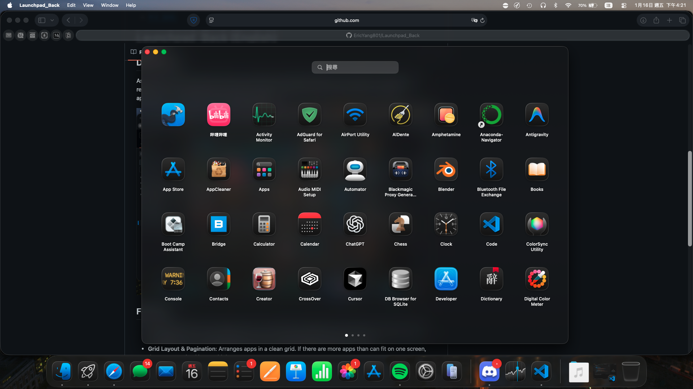

# LaunchHistory

> 高性能原生 Launchpad 替代品，适配 macOS 15+，基于 SwiftUI + AppKit 构建。

**[English](./README.md) | [繁體中文](./README_zh-TW.md) | [简体中文](./README_zh-CN.md)**

<div align="center">
  
</div>

## ✨ 功能特性

### 核心功能
- **四指捏合** 打开/关闭启动器（通过 MultitouchSupport 框架实现系统级手势识别）
- **⌘+L 全局热键** 随时唤醒
- **触发角** 激活支持
- **三指拖动** 重新排列应用或创建文件夹（AppKit NSPanel 覆盖层，CPU 平均占用 15.6%）
- **长按 0.2 秒** 进入编辑模式（图标抖动动画）
- **搜索** 实时过滤应用名称、Bundle ID 或路径
- **文件夹** 支持拖动创建、展开/收起、拖出
- **自定义应用来源** 不限于 /Applications（可配置路径）

### 界面与体验
- **水平分页** 或 **垂直滚动** 布局模式
- **背景模糊** 可调节透明度
- **蓝色插入指示器** 拖动时显示精确落点位置
- **应用隐藏** 从启动器隐藏（不卸载）
- **自定义重命名** 任意应用
- **多语言** 支持（English、简体中文、繁體中文）跟随系统语言

### 性能表现
- **CPU 占用**：空闲 0.1%，三指拖动时约 15%（从 23.6% 优化）
- **内存占用**：160-190MB 稳定
- **AppKit NSPanel** 拖动覆盖层（绕过 SwiftUI 重渲染）
- **30ms 节流** 落点计算（从 125-250Hz 降至约 33Hz）
- **图标缓存** 异步加载 + NSWorkspace 兜底

## 🎯 项目背景

macOS 15 (Sequoia/Tahoe) 移除了部分 Launchpad 自定义选项。本项目恢复完整控制：
- 基于手势的激活方式，无需依赖 Dock
- 原生性能（非 Electron/Web 包装）
- 完整拖放排序 + 视觉反馈
- 可扩展的文件夹系统

## 📦 安装

### 方式 1：从源码构建

**要求**：Xcode 16+、macOS 15+

```bash
git clone https://github.com/EricYang801/Launchpad_Back.git
cd Launchpad_Back
open Launchpad_Back.xcodeproj
```

按 `⌘+R` 运行，或使用命令行：

```bash
xcodebuild -project Launchpad_Back.xcodeproj -scheme Launchpad_Back -configuration Release build
```

### 方式 2：下载发布版本（即将推出）

预编译的 `.app` 包将发布在 [Releases](../../releases) 页面。

## 🚀 使用方法

1. **启动** 应用 — 运行在菜单栏
2. **打开启动器**：
   - 按 `⌘+L`（全局热键）
   - 触控板四指捏合
   - 将光标移至配置的触发角
3. **重新排列应用**：
   - **长按** 任意图标 0.2 秒 → 抖动模式 → 拖动到新位置
   - **三指拖动** 直接拖动任意图标（无需长按）
4. **创建文件夹**：将一个应用拖到另一个应用上
5. **搜索**：启动器打开时直接输入
6. **设置**：点击右上角齿轮图标

## ⚙️ 配置

通过启动器中的齿轮图标访问设置：

- **布局模式**：水平分页 / 垂直滚动
- **背景模糊**：调节透明度（0-100%）
- **搜索栏**：显示/隐藏
- **触发角**：选择激活角落
- **应用来源**：添加 `/Applications` 以外的自定义目录
- **隐藏应用**：管理可见性
- **语言**：自动检测系统语言

## 🛠️ 架构

- **SwiftUI** 主界面（网格布局、文件夹视图、设置）
- **AppKit** 用于：
  - 全局热键（`CGEventTap`）
  - 浮动拖动覆盖层（`NSPanel` 在 `.screenSaver` 层级）
  - 触发角监控（`NSEvent.addGlobalMonitorForEvents`）
- **MultitouchSupport.framework**（私有框架）用于四指捏合和三指拖动检测
- **UserDefaults** 持久化存储（应用顺序、文件夹、隐藏应用、设置）

### 关键性能优化
1. **NSPanel 覆盖层**：拖动图标在独立窗口渲染，绕过 SwiftUI body 重计算（125-250Hz → 0Hz 主视图更新）
2. **落点节流**：30ms 间隔（250Hz → 33Hz 计算频率）
3. **图标缓存**：共享 `AppIconCache` 异步加载，`NSWorkspace.icon(forFile:)` 兜底
4. **手势协调器**：直接回调 SwiftUI state，无轮询

## 🧪 测试

运行单元测试：

```bash
xcodebuild test -scheme Launchpad_Back -destination 'platform=macOS'
```

测试覆盖：
- 图标解析（直接路径、符号链接、元数据、兜底）
- 图标缓存（规范路径、并发请求、去重）
- 文件夹 CRUD 操作和顺序持久化
- 搜索匹配（名称、Bundle ID、路径）
- 分页边界和切片
- 布局重置行为

## 📝 路线图

- [ ] 从启动器卸载应用（移至废纸篓）
- [ ] 可自定义网格大小（行 × 列）
- [ ] iCloud 同步布局/文件夹
- [ ] 嵌套文件夹（目前单层）
- [ ] 键盘导航（方向键）

## 🤝 贡献

欢迎贡献！请：
1. Fork 本仓库
2. 创建功能分支（`git checkout -b feature/amazing-feature`）
3. 提交更改（`git commit -m 'Add amazing feature'`）
4. 推送到分支（`git push origin feature/amazing-feature`）
5. 打开 Pull Request

## 📄 许可证

GPL-3.0 许可证。详见 [LICENSE](./LICENSE)。

## 🙏 致谢

- **MultitouchSupport.framework** 逆向工程社区
- **macOS 手势** 灵感来自 iOS/iPadOS SpringBoard
- **AppKit + SwiftUI** 混合架构实现高性能

---

**关键词**：Launchpad 替代品、macOS 启动器、SwiftUI AppKit、四指手势、三指拖动、macOS 15 启动器、Sequoia 替代方案
